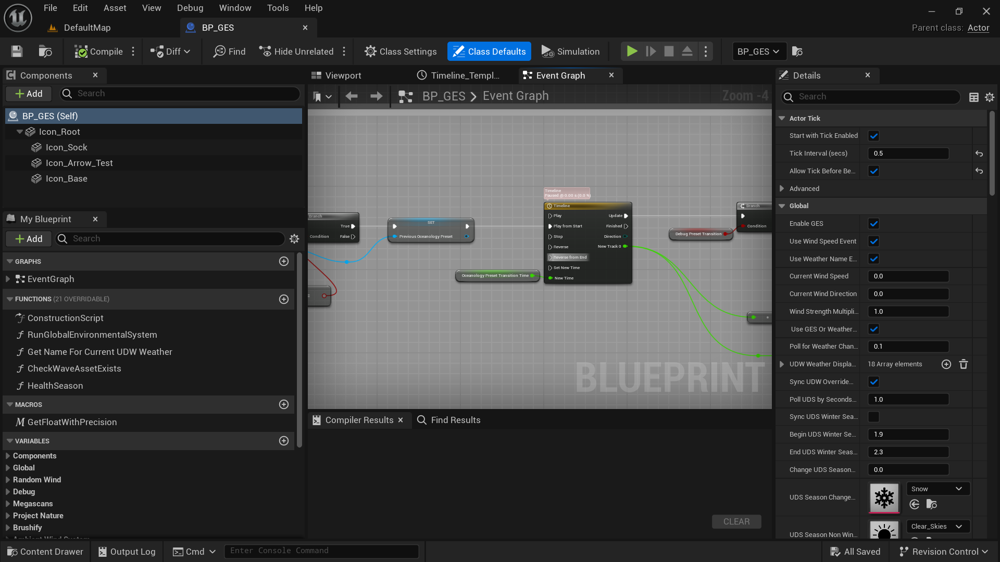
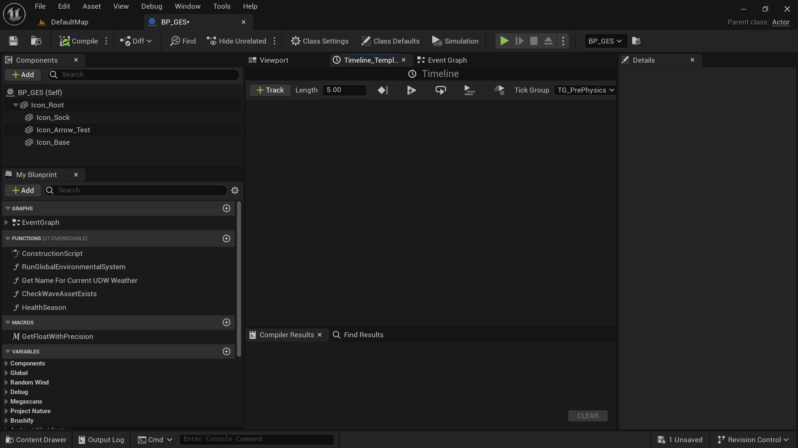
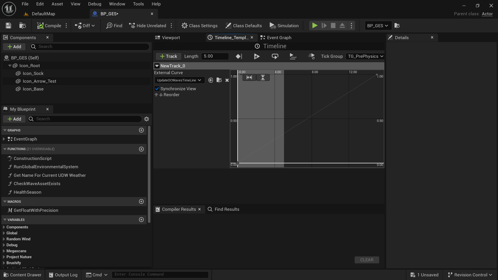

## 1) <u>Intro</u>

Make your landscape interact with weather, wind, water, foliage and your player like the real world.  Global Environmental System or GES for short combines various systems with Ultra Dynamic Sky and Weather to make your environment act more like the real world.  As you change the weather from Calm Skies to Thunderstorm your foliage and trees will change in speed accordingly. **NOTE:** Ultra Dynamic Sky is the only requirement and is a paid plugin on the UE Marketplace you can get <a href="https://www.unrealengine.com/marketplace/en-US/product/ultra-dynamic-sky" target="_blank">here</a> 

Video Demo 

<iframe src="https://www.youtube.com/embed/CfE0y1k4r6w" 
        title="GES Demo" frameborder="0" allowfullscreen
        allow="accelerometer; clipboard-write; encrypted-media; gyroscope; picture-in-picture" 
        style="position: absolute; width: 100%; height: 100%;">
</iframe>

## 2) <u>What you get</u>

1) Global Environmental System Blueprint (GES) -- Change wind strength, direction, seasons, health, and weather effects on trees, foliage and props such as rocks or logs. Season and health changes are limited to Megascan trees and foliage.

2) Ultra Dynamic Sky/Weather Integration -- Weather effects are added to MS Materials. https://www.unrealengine.com/marketplace/en-US/product/ultra-dynamic-sky?sessionInvalidated=true

2) Megascan Foliage and Trees Integration  -- Wind and Weather effects added. Trees https://www.unrealengine.com/marketplace/en-US/product/megascans-trees-european-hornbeam-early-access

3) Foliage Interaction and Wind System -- This system was extracted and modified from the awesome Project Nature pack -- Permenantly Free Nature Assets on UE Marketplace https://www.unrealengine.com/marketplace/en-US/profile/Project+Nature?count=20&sortBy=effectiveDate&sortDir=DESC&start=

4) Foliage Health And Season -- Adjust the color of your foliage.  Extracted from MS Global Foliage Actor. Season color change linked to UDW season change for Megascan foliage and trees.

5) Ambient Wind System Integration -- Enable any actor to receive wind  https://www.unrealengine.com/marketplace/en-US/product/ambient-wind-system

6) Project Nature Integration   -- https://www.unrealengine.com/marketplace/en-US/profile/Project+Nature?

6) UE Water Integration -- Change the Wave Asset file based on the current Weather 

7) SpeedTree Integration 

8) Brushify Integration

9) MAE Integration

10) Particle and Wind Control System Integration -- Free from Unreal https://www.unrealengine.com/marketplace/en-US/product/particles-and-wind-control-system

11) Mawi Integration -  Wind and direction don't work as well as the other systems due to Mawi's wind system.

12) Oceanology and Lake

13) Riverology

14) [Sky Creator][1] as an alternative weather system to UDS.

15) Easily add any other system for basic wind speed and direction change by changing that systems Material Parameter Collection values.  Example included.

## 3) <u>Installation</u>

1) GES has many systems already integrated.  You need to download the systems you want to use and add them to your project before installing GES.  For example if you are using Brushify make sure it is added to your project first.

2) Ultra Dynamic Sky must be added to your project before adding GES. UDS is a paid plugin on the market place. [Link here][2]. Alternatively you can use SkyCreator or another weather system but other steps are needed.  The default install expects UDS to be installed in your project.

3) Download the latest release for your version of Unreal.  Currently only the latest version of UE will receive bug fixes and enhancements.  Download the release from <a href="https://github.com/delebash/UE_GlobalEnvironmentalSystem/releases" target="_blank">here</a>

4) Unzip the download and copy the Content and Plugin folder to your root project folder.  Note: The plugin folder is only necessary if you are using Unreal's Water Plugin.

5) Setup individual systems, see next section

6) Ges video playlist https://www.youtube.com/playlist?list=PLFCVXzupw1r8cSfpG7na7TCxghJVpj1Ov

<iframe src="https://www.youtube.com/embed/0sirSDGcr2I" 
        title="GES - General Setup information with Megascan specific setup" frameborder="0" allowfullscreen
        allow="accelerometer; clipboard-write; encrypted-media; gyroscope; picture-in-picture" 
        style="position: absolute; width: 100%; height: 100%;">
</iframe>

## 4) <u>Individual System setup</u>

### **Megascan Setup**

1) First you need to download some megascan assets so that all the default materials will be downloaded that we will eventually overwrite some of them in the MSPreset folder.

2) When you download MS assets it creates an MSPreset folder with the materials for the asset type you downloaded.

3) List of materials that will need to be downloaded in the MSPreset folder.  You only need to download what you will use.  The _VT will only show up if you have Runtime Virtual Textures enabled for your project.  

> MS_Foliage_Material, M_MS_Surface_Material_VT, M_MS_Surface_Material, M_MS_Foliage_Material, M_MS_Default_Material_VT, M_MS_Default_Material, M_MS_Default_Fuzz_Material_VT, M_MS_Default_Fuzz_Material, M_MS_Billboard_Material

> Example downloads I use. I download a rock or log -- uses the M_MS_Default_Material.  Next a rock with moss -- uses the M_MS_Default_Fuzz_Material.  Some foliage -- uses M_MS_Foliage_Material. A Surface -- M_MS_Surface_Material. A Tree pack - use the MS_Foliage_Material.

4) With your project closed.  From your folder explorer in your projects Content Folder, navigate to the folder GlobalEnvironmentalSystem --> Integrations --> Megascans.  Copy the MSPreset folder and paste it in your Content folder overwriting the existing MSPreset folder. 

#### Material Instance for Foliage
##### Wind

I have replaced the default wind for Megascan foliage with Project Natures foliage and interaction system. For each MI you will need to check the 3 check boxes shown below under Preset Parameters. 

Additional information on wind and bending settings can be found in the [Project Nature Documentation](./ProjectNatureDocumentation.pdf)

##### Ultra Dynamic Weather and Automatic Season (Optional)

1) Check box Use UDW Weather ? and enable it.  
  

2) Megascan foiliage material also has automatic integration with UDW season change. To enable check the boxes for Use UDS date For Autumn? and/or Use UDS date For Winter?.  Additional settings for withered leaves will become available.

3) Once you have enabled Use UDS Date scroll up to the Seasons section and enable Affected by Winter/Autumn.  Additional Autumn settings will be available.

##### Manual Health and Season
If you are not using automatic season change you can check the Seasons checkbox and manually adjust the color.  In addition there are global settings in the BP_GES for seasons.

#### Material Instance for Trees

**Bug Note:**  There is a small bug for MS Trees that have the Albedo Tint control like the Norway Maple.  The tree will show up purple.  Just open the MI for the leaves and change the Albedo Tint to 1,1,1,0

For trees the wind system is the default system that comes with MS trees.  I have added Project Nature interaction to the tree materials.  In addition we have UDW and season change.

1) To enable UDW and Season change select your tree in the scene or find the MI's for tree you want. You will notice several MI's for leaves, bark, and imposter.  For each MI you will need to enable settings to get the effect you want.

2) Open the leaves MI.  Check enable Use UDW Weather?

##### Ultra Dynamic Weather and Automatic Season (Optional)

MS tree leaves have the same settings as MS foliage except in how you enable winter.  MS trees has the Season setting enabled by default.  .

To get automatic season change for Winter enable Winter under Season.  For Autumn enable affected by Autumn.

The Bark MI's only have Use UDW Weather ?

The Impostor has the same settings as the leaves, depending on performance you may or may not want to enable.

##### Manual Health and Season

Same as foliage

### **Brushify Setup**

1) With your project closed.  From your folder explorer in your projects Content Folder, navigate to the folder GlobalEnvironmentalSystem --> Integrations --> Brushify

2) Copy the Materials folder and paste in your Content --> Brushify folder overwriting the Materials folder.

### **Project Nature Setup**

1) With your project closed.  From your folder explorer in your projects Content Folder, navigate to the folder GlobalEnvironmentalSystem --> Integrations --> Project Nature

2) Copy the Materials folder and paste in each of your Project Nature packs folders overwriting the Materials folder.

3) If you want UDW weather effects you need to add that UDW function to the material function you want to use.  As an example for the spruce pack you can copy the PN_interactiveSpruceForest and overwrite the existing one.  All I am doing is adding the UDW function to it. GES comes with a convenience function that wraps the UDW Weather effects.  In the material you want to add the weather effects to type MF_ApplyWetnessSnowDustUDW and hook it up to your material at the end.

### **SpeedTree setup**

1) With your project closed.  From your folder explorer in your projects Content Folder, navigate to the folder GlobalEnvironmentalSystem --> Integrations --> SpeedTree

2) Copy SpeedTreeBillboardMaster.uasset and SpeedTreeMaster.uasset and overwrite those files in you Engine folder.  As an alternative in your project make sure you show your Engine folder by clicking the asterick and checking Show Engine.  Search for each of the above assets and for each one choose delete and then in the delete window choose replace.  In the replace with choose the assets with the same name inside the Integrations --> SpeedTree folder. 

### **Mae** 

no setup needed

### **Mawi** 

no setup needed

### **Particle and Wind Control System**

Connect the line execution line in the below function
Integrations>Particle_Wind_Control_System>BPFunctions>BP_GES_Particles_Wind_Control_System function.

### **Ambient Wind System** 

Connect the line in the GES Integrations>AmbientWindSystem>BPFunctions>BF_GES_AmbientWindSystem! function.

### **Oceanology**

You will need to go to the below link and copy and paste the code and hook them up after you have installed Oceanology and enabled it in your Plugins for that project.

 Go to this link https://blueprintue.com/blueprint/1bi82s7z/ Scroll down and click on code to copy. In the GES Integrations>Oceanology>BPFunctions open BP_GES_Oceanology then zoom out and move over to get some space and paste.  Then connect things up as shown in the picture below and save and compile. 
 
 
   
   
**Oceanology Preset Transition Setup** 
(This is an experimental feature of Oceanology and currently is buggy.)
   
   This needs to be added to an event graph.  I am using my example level blueprint for testing. 
   
   Open BP_GES GlobalEnvironmentalSystem>Blueprints>BP_GES.  Goto the Event Graph.  Go to https://blueprintue.com/blueprint/febz_d3y/ copy.  In the event graph move above existing code you will see a reroute node with no connection.  Paste there and connect. Compile and save.
   
   
   
   Next click on the Time Line node in the nodes you just pasted from above.  Click add track and select new float track.  Then in the external curve drop down type OC and choose UpdateOCWavesTimeline
   
   
   
   
   
   
   
   
   
   Go to your GES properties and enable Oceanology, Define your wind speed array if not already defined and check OC Use Preset Transition.
   
**Oceanology Preset Transition Low Hi**
Instead of using the wind speed array to determine which oceanology preset to use you can specify a low to high preset.  As an example choose a Low Oceanology Preset of Beufort Calm and a Hi Oceanology Preset of Beufort Severe Gail. Then in addition to checking OC Use Preset Transition check OC Use Low Hi  Transition.  This means that as the wind speed increases it will transition from the low preset to the high preset and vice verse.

### **Oceanology Lake referred to as Lakeology**

You will need to go to the below link and copy and paste the code and hook them up after you have installed Oceanology and enabled it in your Plugins for that project.

 Go to this link https://blueprintue.com/blueprint/z_d8ydzp/ Scroll down and click on code to copy. In the GES Integrations>Lakeology>BPFunctions open BP_GES_Lakeology then zoom out and move over to get some space and paste.  Then connect things up as shown in the picture below and save and compile.
 
 

## 5) <u>Add GES Blueprint to your Scene</u>

Navigate to GlobalEnvironmentalSystem --> Blueprints and drag BP_GES to your scene.

## 6) <u>Wind Speed Array</u>

This is how you change the wind speed of your assets based on UDW wind speed

<iframe src="https://www.youtube.com/embed/dcRN69tyMhQ" 
        title="Ges - Explanation of the wind speed array" frameborder="0" allowfullscreen
        allow="accelerometer; clipboard-write; encrypted-media; gyroscope; picture-in-picture" 
        style="position: absolute; width: 100%; height: 100%;">
</iframe>

### Understanding how to adjust wind speed for your systems

1. **Use Wind Speed Event, Use Weather Name Event** -- This determines when GES fires and runs through each enabled system.  
    
    a. **Weather Name Change** --  Weather names are defined in the **UDW Weather Display Name Array**. As the weather name changes from say Clear Skies to Cloudy GES gets notified of that name change. We will explain how to define this array later.  By default the array is filled for use with the predefined UDW weather types.
    
    b. **Wind Speed Change** --  Wind speed change does not use the Weather Name Change event.  Both the Weather Name Change and the Wind speed change use a polling method to determine the current values of the UDW current weather wind speed. However, Wind Speed Change runs GES every time the poll event is fired, where Weather Name Change only runs GES on a change of Weather Name. The **Poll for Weather Changes** determines in seconds how often we check for these values.  By default it is set to 1/10 of a second.  If you are only going to use Wind Speed Change then you do not need to define the **UDW Weather Display Name Array**
    
    c. Both are enabled by default as this covers any case.

2. **Use GES Or Weather System Wind Direction** -- 

Wind direction can be controlled using the GES wind sock or from the weather system such as UDS or UDW which is the weather part of UDS.

3. **Poll for Weather Changes** -- 

Poll in seconds for UDW current weather values.  Default 1/10th or .1 of a second.

4. **The default setup is to use wind speed change instead of weather name change** so you can skip sections 6 and 7 and part of 5.

5.  **How are each systems wind settings determined?**

    1. MS Use Wind Speed Array Or Direct -- If checked then you will use the Wind speed array.  Else you will use direct value output of UDW current wind speed which is 0-10
    
    2. Explanation of the Wind Speed Array -- 
       
        a. **Use Weather Name or Value**  -- You can choose to match your chosen wind speed based on Weather Name using the **Weather Type Enum** or a wind speed range value.  If using value then you do not need to choose a weather type.  Instead use the **Wind Speed Greater Than Equal** and **Wind Speed Less Than Equal** fields.  So if you define the fields to be 0 and 2 respectively.  Then when the UDW value is between 0 and 2 then this array value will be true and use the settings in this array. In image number 2 we have set the range and the wind speed of our foliage and trees, we could also set the other values for MS.  So when UDW wind speed is between 0-2 then our foliage speed will be 3 and our tree wind speed will be 4.
       
       
    
    
    
    
    
    
      b. If using Weather name then when the display name that you defined in the Weather Display Names matches the Weather Type Enum then this array value will be true.

6. **UDW Weather Display Name Array -- Skip this section if you only want to use wind speed change** -- 

Define each weather name based on various values of the current UDW weather.  UDW weather changes based on 1. The weather preset chosen, in this case the exact values defined in the weather preset are output if you have set transition to 0.  However if you are using a transition speed or an override volume then the weather will change gradually.  As an example say you have Clear Skies set as your current weather preset. Then you have an override volume with a weather preset set to Thunderstorm.  Than as your player moves through the override volume the UDW weather values will change, such as wind speed, cloud amount, rain amount and so on.  These values will not directly match each preset so we have to make our own determination of when we want the weather display name to show or match.

Lets take a look at a couple of pictures illustrating the values UDW generates for weather types. Under the Debug heading you can enable **Debug Weather Values** to print to the screen the current weather values.  This is very useful when setting up a display name.

As you can see we have the current weather values.  Since we are not in any transition the values exactly match the current weather preset.  The current preset is set to Clear Skies.  With wind speed being 2.0 and every other value 0.0

Now lets walk forward into our override volume which is set to Thunderstorm.  We can see the weather values changing and if you look at the **UDW Weather Display Name Array** we can see the values we are defining in order to determine when we change the weather name.  We can see that the value of cloud is 0.52 and we have defined Partly Cloudy Cloud Coverage between 0.51 and 3.8 for Partly Cloudy. Although the picture is not showing Clear Skies it is defined between 0.0 and 0.50.  The check box for each weather such as Use Cloud Coverage is like an and statement.  So for each item checked the weather has to match the between values in order for that weather name to be true and display.  You have to be careful when defining weather names as you might overlap the truthiness of a weather name.  So if you define one weather name to use Cloud Coverage between 0 and 1 for Clear Skies and Light Snow to also have Cloud Coverage between 0 and 1 then both will be true and you will get the last one.  This is why we have a checkbox for each value as we may use multiple values to determine a weather name.  Use the debug feature to test your new weather types and an override volume to make sure you are getting the weather names you want.

7. **Custom Weather Display Names -- Skip if using wind speed change**
    So all the default Weather Names that come with UDW are setup for you.  If you want a custom name for the Enum you need to add it to the GES>Enum>GES_UDS_Weather_Display_Names file.  Now it will be displayed in the Weather Display Name drop down list and you can associate it with a weather type the same way as above.  For example I added Sun Shower to the Enum.  Then I setup a new UDW Weather Preset and set Rain to 3 and Wind Intensity to 3 and everything else to 0.  Then in the GES UDW Weather Display Name Array I added an entry for it with Cloud Coverage enabled and set to 0 for both and Rain enabled set to .1 and 3.
    

## 7) <u>UDW Level Blueprint for testing</u>
An example blueprint that demonstrates how changing UDW weather interacts with GES.  Go to this link https://blueprintue.com/blueprint/p-4zaw-8/ Scroll down and click on code to copy. Open your level blueprint and paste.

Paste the information you copied above into the blueprint.  Then right click and choose create variable for each variable in the comment box indicated. Also in the Create Menu drop down type GES and choose GES_MainMenuWidget.  You can see in the comments how the functions are called to make GES work.

<iframe src="https://www.youtube.com/embed/8yauMzqsLEE" 
        title="Ges - Level blueprint for testing" frameborder="0" allowfullscreen
        allow="accelerometer; clipboard-write; encrypted-media; gyroscope; picture-in-picture" 
        style="position: absolute; width: 100%; height: 100%;">
</iframe>

## 8) Foliage Interaction
Megascans, Project Nature, and SpeedTree have been setup to use the foliage interaction system referred to as FIWS (Foliage Interaction Wind System), this system was extracted from Project Nature so big thanks to them.

Each material instance for the above systems has a check box to enable interaction. 

Additionally you have to setup your character and add a component to your scene.  
    
   1. If you are using 3rd person character you can copy the 3rd person character in GES>Blueprints>ThirdPerson and over write your 3rd person in your content folder.
   
   2. Manually setup your character.  Open your characters blueprint and in components click add and search for FIWS_Bending_Component and add.  Then make sure your BP_ThirdPersonCharacter is selected and add a tag called Bending.
   
   
   
   
   
   3. Add the FIWS_GlobalUpdater to your scene, located in GES>FoliageInteractionWindSystem>Blueprints.
   
   4. Check use foliage interaction in your material instances.
   
   5. There are various bending option in the material instance.  You can refere to project natures documentation for further info both on wind and interaction. [Project Nature Documentation](./ProjectNatureDocumentation.pdf)

## 9) <u>Using an alternate wind system</u>
a. **Sky Creator**

  [1]: https://www.unrealengine.com/marketplace/en-US/product/sky-creator
  [2]: https://www.unrealengine.com/marketplace/en-US/product/ultra-dynamic-sky
